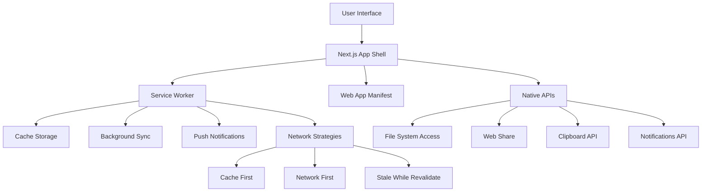

# Design Document

## Overview

The PWA conversion transforms Open-Fiesta into a Progressive Web App that provides native app-like experiences across desktop and mobile platforms. The design leverages Next.js's built-in PWA capabilities while implementing advanced web APIs for offline functionality, push notifications, and device integration. The solution maintains the existing architecture while adding service worker-based caching, background sync, and native device integrations.

## Architecture

### High-Level PWA Architecture



### PWA Core Components

1. **App Shell**: Minimal HTML, CSS, and JavaScript for instant loading
2. **Service Worker**: Background script for caching, sync, and notifications
3. **Web App Manifest**: Metadata for installation and app behavior
4. **Cache Strategy**: Intelligent caching for offline functionality
5. **Background Sync**: Queue actions when offline, sync when online
6. **Push Notifications**: Server-sent notifications for user engagement

### Integration with Existing Architecture

- **Next.js Framework**: Enhanced with PWA plugins and configurations
- **Supabase Integration**: Offline-first data synchronization
- **API Routes**: Cached responses with fallback strategies
- **Component System**: Progressive enhancement for PWA features
- **Theme System**: Cached for instant loading and offline access

## Components and Interfaces

### Core PWA Components

#### 1. PWA Configuration
```typescript
// next.config.js PWA configuration
const withPWA = require('next-pwa')({
  dest: 'public',
  register: true,
  skipWaiting: true,
  runtimeCaching: [
    {
      urlPattern: /^https:\/\/api\./,
      handler: 'NetworkFirst',
      options: {
        cacheName: 'api-cache',
        expiration: {
          maxEntries: 100,
          maxAgeSeconds: 24 * 60 * 60 // 24 hours
        }
      }
    }
  ]
});
```

#### 2. Service Worker Manager
```typescript
interface ServiceWorkerManager {
  register(): Promise<ServiceWorkerRegistration>;
  update(): Promise<void>;
  skipWaiting(): Promise<void>;
  getCacheStatus(): Promise<CacheStatus>;
  clearCache(): Promise<void>;
}

interface CacheStatus {
  totalSize: number;
  cacheNames: string[];
  lastUpdated: Date;
}
```

#### 3. Offline Manager
```typescript
interface OfflineManager {
  isOnline(): boolean;
  queueAction(action: OfflineAction): void;
  syncQueuedActions(): Promise<void>;
  getCachedConversations(): Promise<ChatThread[]>;
  cacheConversation(thread: ChatThread): Promise<void>;
}

interface OfflineAction {
  id: string;
  type: 'SEND_MESSAGE' | 'UPDATE_THREAD' | 'DELETE_THREAD';
  payload: any;
  timestamp: number;
  retryCount: number;
}
```

#### 4. Push Notification Manager
```typescript
interface PushNotificationManager {
  requestPermission(): Promise<NotificationPermission>;
  subscribe(): Promise<PushSubscription>;
  unsubscribe(): Promise<void>;
  sendNotification(notification: PWANotification): Promise<void>;
}

interface PWANotification {
  title: string;
  body: string;
  icon?: string;
  badge?: string;
  tag?: string;
  data?: any;
  actions?: NotificationAction[];
}
```

#### 5. Native Integration Manager
```typescript
interface NativeIntegrationManager {
  shareContent(content: ShareData): Promise<void>;
  accessFileSystem(): Promise<FileSystemHandle>;
  copyToClipboard(text: string): Promise<void>;
  requestWakeLock(): Promise<WakeLockSentinel>;
  getBadgeCount(): Promise<number>;
  setBadgeCount(count: number): Promise<void>;
}

interface ShareData {
  title?: string;
  text?: string;
  url?: string;
  files?: File[];
}
```

### PWA-Enhanced Components

#### 1. InstallPrompt Component
```typescript
interface InstallPromptProps {
  onInstall: () => void;
  onDismiss: () => void;
  isVisible: boolean;
}

const InstallPrompt: React.FC<InstallPromptProps> = ({
  onInstall,
  onDismiss,
  isVisible
}) => {
  // Render install prompt UI
  // Handle beforeinstallprompt event
  // Provide custom install experience
};
```

#### 2. OfflineIndicator Component
```typescript
interface OfflineIndicatorProps {
  isOnline: boolean;
  queuedActions: number;
  onSync: () => void;
}

const OfflineIndicator: React.FC<OfflineIndicatorProps> = ({
  isOnline,
  queuedActions,
  onSync
}) => {
  // Display connection status
  // Show queued actions count
  // Provide manual sync option
};
```

#### 3. UpdateNotification Component
```typescript
interface UpdateNotificationProps {
  updateAvailable: boolean;
  onUpdate: () => void;
  onDismiss: () => void;
}

const UpdateNotification: React.FC<UpdateNotificationProps> = ({
  updateAvailable,
  onUpdate,
  onDismiss
}) => {
  // Notify about app updates
  // Provide update installation option
  // Handle update process
};
```

## Data Models

### PWA Configuration Model
```typescript
interface PWAConfig {
  name: string;
  shortName: string;
  description: string;
  startUrl: string;
  display: 'standalone' | 'fullscreen' | 'minimal-ui' | 'browser';
  orientation: 'portrait' | 'landscape' | 'any';
  themeColor: string;
  backgroundColor: string;
  icons: PWAIcon[];
  categories: string[];
  shortcuts: PWAShortcut[];
}

interface PWAIcon {
  src: string;
  sizes: string;
  type: string;
  purpose?: 'any' | 'maskable' | 'monochrome';
}

interface PWAShortcut {
  name: string;
  shortName?: string;
  description?: string;
  url: string;
  icons: PWAIcon[];
}
```

### Cache Strategy Model
```typescript
interface CacheStrategy {
  name: string;
  urlPattern: RegExp | string;
  handler: 'CacheFirst' | 'NetworkFirst' | 'StaleWhileRevalidate' | 'NetworkOnly' | 'CacheOnly';
  options: CacheOptions;
}

interface CacheOptions {
  cacheName: string;
  expiration?: {
    maxEntries: number;
    maxAgeSeconds: number;
  };
  cacheKeyWillBeUsed?: (request: Request) => Promise<string>;
  cacheWillUpdate?: (response: Response) => Promise<boolean>;
}
```

### Background Sync Model
```typescript
interface BackgroundSyncTask {
  id: string;
  tag: string;
  data: any;
  createdAt: Date;
  lastAttempt?: Date;
  attempts: number;
  maxAttempts: number;
  status: 'pending' | 'syncing' | 'completed' | 'failed';
}

interface SyncResult {
  success: boolean;
  error?: string;
  retryAfter?: number;
}
```

## Error Handling

### PWA-Specific Error Scenarios

1. **Service Worker Registration Failure**
   - Fallback to normal web app functionality
   - Display informational message about reduced offline capabilities
   - Retry registration on next visit

2. **Cache Storage Quota Exceeded**
   - Implement cache cleanup strategies
   - Prioritize essential resources
   - Notify users about storage limitations

3. **Background Sync Failures**
   - Implement exponential backoff retry logic
   - Queue failed actions for manual retry
   - Provide user feedback about sync status

4. **Push Notification Failures**
   - Handle permission denied gracefully
   - Provide alternative notification methods
   - Allow users to re-enable notifications

### Error Recovery Strategies

```typescript
interface PWAErrorHandler {
  handleServiceWorkerError(error: Error): void;
  handleCacheError(error: Error): void;
  handleSyncError(error: Error, task: BackgroundSyncTask): void;
  handleNotificationError(error: Error): void;
}

class PWAErrorRecovery {
  static async recoverFromCacheFailure(): Promise<void> {
    // Clear corrupted cache
    // Reinitialize cache storage
    // Reload essential resources
  }
  
  static async recoverFromSyncFailure(task: BackgroundSyncTask): Promise<void> {
    // Implement retry logic
    // Update task status
    // Notify user if manual intervention needed
  }
}
```

## Testing Strategy

### PWA Testing Approach

1. **Lighthouse PWA Audits**
   - Automated PWA compliance testing
   - Performance and accessibility validation
   - Best practices verification

2. **Service Worker Testing**
   - Cache strategy validation
   - Background sync functionality
   - Update mechanism testing

3. **Offline Functionality Testing**
   - Complete offline user journeys
   - Data synchronization validation
   - Cache invalidation testing

4. **Cross-Platform Testing**
   - Desktop installation and functionality
   - Mobile app-like behavior
   - Different browser PWA implementations

### Testing Tools and Frameworks

```typescript
// PWA testing utilities
interface PWATestUtils {
  simulateOffline(): Promise<void>;
  simulateOnline(): Promise<void>;
  clearAllCaches(): Promise<void>;
  triggerBackgroundSync(): Promise<void>;
  mockPushNotification(notification: PWANotification): Promise<void>;
}

// Lighthouse CI integration
const lighthouseConfig = {
  ci: {
    collect: {
      numberOfRuns: 3,
      settings: {
        chromeFlags: '--no-sandbox'
      }
    },
    assert: {
      assertions: {
        'categories:pwa': ['error', { minScore: 0.9 }],
        'categories:performance': ['warn', { minScore: 0.8 }]
      }
    }
  }
};
```

## Security Considerations

### PWA Security Model

1. **HTTPS Requirement**
   - All PWA features require secure contexts
   - Implement proper SSL/TLS configuration
   - Handle mixed content scenarios

2. **Service Worker Security**
   - Validate all cached resources
   - Implement Content Security Policy
   - Prevent cache poisoning attacks

3. **Data Protection**
   - Encrypt sensitive data in cache
   - Implement secure storage for API keys
   - Handle biometric authentication

4. **Permission Management**
   - Request minimal necessary permissions
   - Provide clear permission explanations
   - Handle permission revocation gracefully

### Security Implementation

```typescript
interface PWASecurity {
  validateCacheIntegrity(): Promise<boolean>;
  encryptSensitiveData(data: any): Promise<string>;
  decryptSensitiveData(encryptedData: string): Promise<any>;
  handlePermissionChange(permission: string, state: PermissionState): void;
}

class SecureCache {
  static async store(key: string, data: any, encrypt: boolean = false): Promise<void> {
    const processedData = encrypt ? await this.encrypt(data) : data;
    await caches.open('secure-cache').then(cache => 
      cache.put(key, new Response(JSON.stringify(processedData)))
    );
  }
  
  static async retrieve(key: string, decrypt: boolean = false): Promise<any> {
    const cache = await caches.open('secure-cache');
    const response = await cache.match(key);
    if (!response) return null;
    
    const data = await response.json();
    return decrypt ? await this.decrypt(data) : data;
  }
}
```

## Performance Optimization

### PWA Performance Strategies

1. **App Shell Architecture**
   - Minimal critical resources for instant loading
   - Progressive enhancement of features
   - Lazy loading of non-critical components

2. **Intelligent Caching**
   - Cache-first for static assets
   - Network-first for dynamic content
   - Stale-while-revalidate for frequently updated data

3. **Resource Optimization**
   - Code splitting for reduced bundle sizes
   - Image optimization and lazy loading
   - Font optimization and preloading

4. **Background Processing**
   - Use Web Workers for heavy computations
   - Implement background sync for data operations
   - Optimize service worker execution

### Performance Monitoring

```typescript
interface PWAPerformanceMonitor {
  trackInstallation(): void;
  trackServiceWorkerPerformance(): void;
  trackCacheHitRatio(): void;
  trackOfflineUsage(): void;
  trackUpdateAdoption(): void;
}

class PerformanceMetrics {
  static recordCachePerformance(cacheName: string, hitRatio: number): void {
    // Record cache performance metrics
  }
  
  static recordServiceWorkerMetrics(metrics: ServiceWorkerMetrics): void {
    // Track service worker performance
  }
  
  static recordInstallationMetrics(installSource: string): void {
    // Track PWA installation sources and success rates
  }
}
```

## Implementation Considerations

### Development Approach

1. **Progressive Enhancement**
   - Start with existing web app functionality
   - Add PWA features incrementally
   - Ensure graceful degradation

2. **Feature Detection**
   - Check for PWA API support
   - Provide fallbacks for unsupported features
   - Progressive feature enablement

3. **Testing Strategy**
   - Automated PWA audits in CI/CD
   - Cross-browser compatibility testing
   - Real device testing for mobile PWA features

### Deployment Strategy

1. **Service Worker Versioning**
   - Implement proper cache invalidation
   - Handle service worker updates gracefully
   - Provide user control over updates

2. **Manifest Optimization**
   - Generate icons for all required sizes
   - Optimize for different platforms
   - Test installation flows

3. **Performance Monitoring**
   - Implement PWA-specific analytics
   - Monitor installation and engagement rates
   - Track offline usage patterns

## Future Enhancements

### Phase 2 PWA Features

1. **Advanced Background Sync**
   - Periodic background sync for data updates
   - Intelligent sync scheduling
   - Conflict resolution for offline changes

2. **Enhanced Native Integration**
   - File system access API
   - Web Share Target API
   - Contact picker API

3. **Advanced Caching Strategies**
   - Predictive caching based on usage patterns
   - Dynamic cache management
   - Cross-origin resource caching

### Phase 3 Cutting-Edge Features

1. **WebAssembly Integration**
   - Client-side AI model processing
   - Advanced text processing capabilities
   - Improved performance for complex operations

2. **Advanced Device APIs**
   - Bluetooth connectivity
   - USB device access
   - Advanced camera and microphone features

3. **AI-Powered PWA Features**
   - Intelligent caching predictions
   - Automated performance optimization
   - Smart notification timing